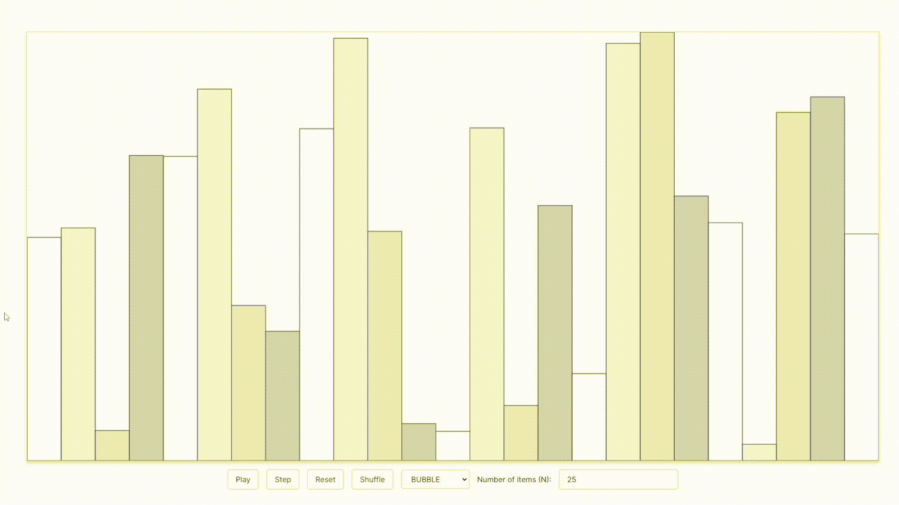

# Sorting Algorithms Visualizer

Sorting Algorithms Visualizer is a project made with Typescript and Next.JS that allows the user to visualize the following sorting algorithms step by step:

- Bubble Sort
- Selection Sort
- Insertion Sort
- Heap Sort
- Merge Sort
- Quick Sort
- Radix Sort

The project was mainly created to learn how generators can be used to visualize the sorting algorithms step by step.

Try it out [here](https://sorting-algorithms-visualizer-kohl.vercel.app/).

# License

[MIT](LICENSE)
